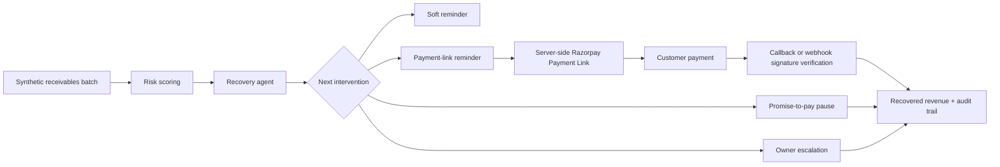

# Architecture

## One-Screen Summary



## Demo Architecture

```text
Synthetic invoices
      |
      v
Risk scoring + intervention selection
      |
      v
Agent action panel
      |
      +--> Create Razorpay test handoff
      +--> Draft reminder
      +--> Record promise-to-pay
      +--> Verified recovery update
      +--> Generate audit summary
```

## Production Architecture

```text
Invoice/CRM data
      |
      v
Recovery agent service
      |
      +--> Razorpay Orders / Payment Links API
      |         |
      |         v
      |   Razorpay Checkout / Payment Link
      |
      +--> Reminder channel
      |
      v
Webhook/signature verification
      |
      v
Update recovered status + audit trail
```

## Razorpay Secret Handling

Production credentials must never be shipped to the browser. A production system should:

- store `RAZORPAY_KEY_ID` and `RAZORPAY_KEY_SECRET` in server-side environment variables
- create orders or payment links on the server
- verify payment signatures or webhooks on the server
- update recovery status only after verified payment success

## Backend

This repo includes a dependency-free Node server that demonstrates the Razorpay boundary without exposing real credentials.

- `GET /api/recovery/state` returns server-owned invoice and audit state.
- `GET /api/recovery/evaluation` returns batch proof metrics from the server state.
- `POST /api/recovery/state` lets browser actions sync into the server state.
- `POST /api/recovery/reset` restores the synthetic batch for clean demos.
- `POST /api/recovery/payment-link` builds a Razorpay Payment Link request shape and returns either a mock test handoff or a real test-mode API response when test keys are configured.
- `POST /api/recovery/ai-explanation` uses a server-side OpenAI key when configured to generate the recovery rationale and reminder draft, with deterministic fallback when no key is present.
- `POST /api/recovery/simulate-verified-payment` demonstrates the same recovered-state transition for local recording.
- `POST /api/recovery/simulate-signed-webhook` creates a local Razorpay-like `payment_link.paid` payload, signs it with a demo-only secret, verifies it through the same webhook handler, and updates recovered state.
- `GET /api/recovery/verify-callback` verifies the Payment Link callback signature on the server and updates invoice state only when the status is paid.
- `POST /api/razorpay/webhook` validates the raw webhook body with `X-Razorpay-Signature` before accepting a `payment_link.paid` state change.
- `GET /api/health` shows whether the backend is in mock mode and whether test secrets are configured.

Mock mode is enabled by default so the demo remains safe for public judging. Real Razorpay test keys should be provided only through local or hosted environment variables.

The runtime state file is `data/recovery-state.json`. It is intentionally ignored by Git because it is generated demo state, not source code.

## Pitch Demo Path

1. Show the summary cards: active risk, recovered revenue, promises, and escalations.
2. Show the analytics row: segment concentration, expected recovery, and intervention mix.
3. Click `Run agent pass` to prove the agent can choose the highest-risk invoice and prepare the handoff.
4. Click `Server handoff` to show the backend-owned Razorpay boundary and request shape.
5. Click `Signed webhook` to show a signed `payment_link.paid` event changing server-owned recovered revenue.
6. Click `Generate report` or `Audit summary` to prove measurement and traceability.
